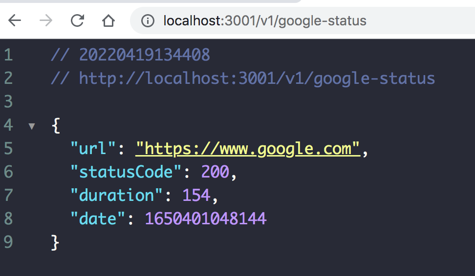
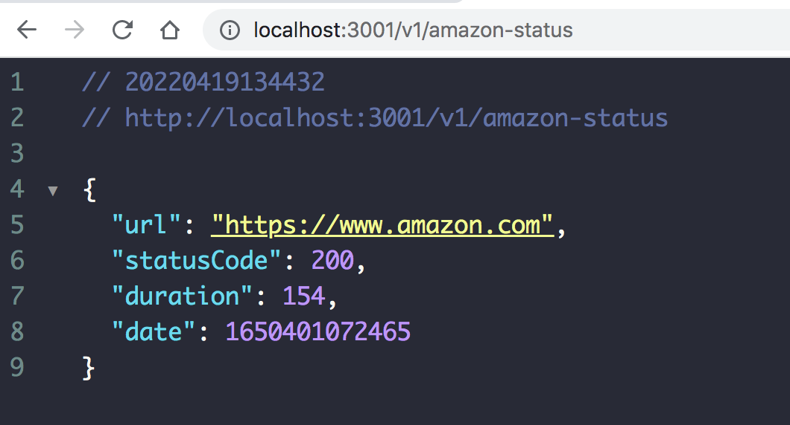
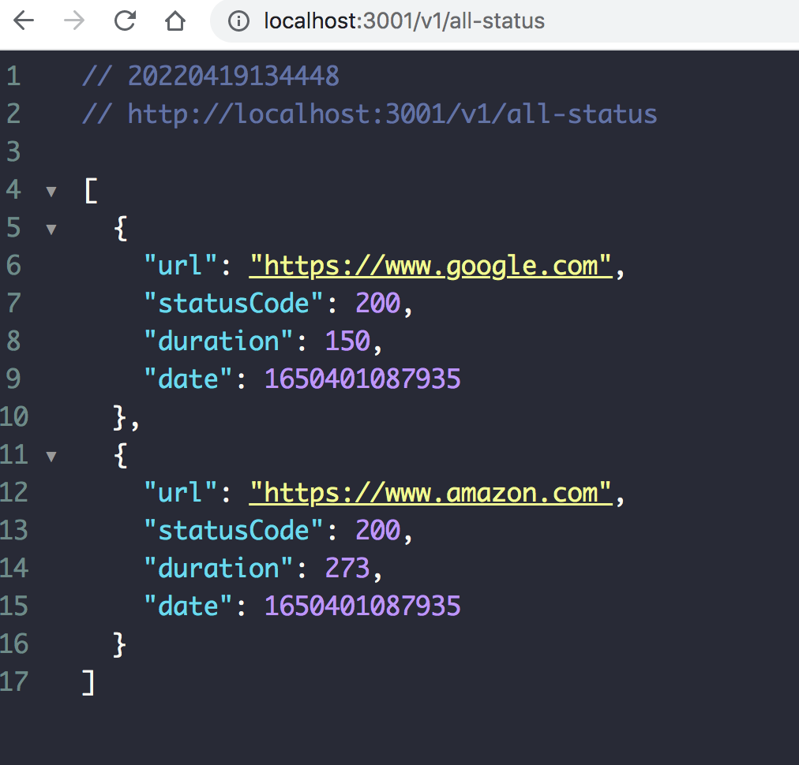
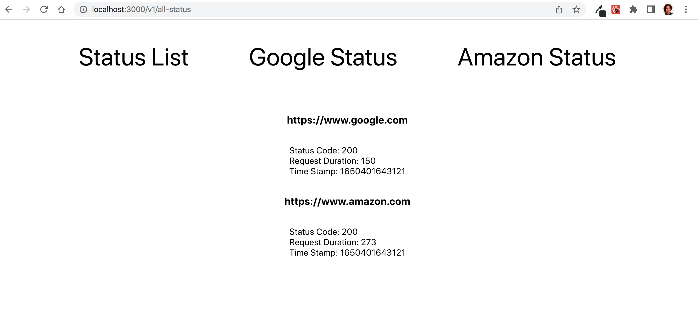
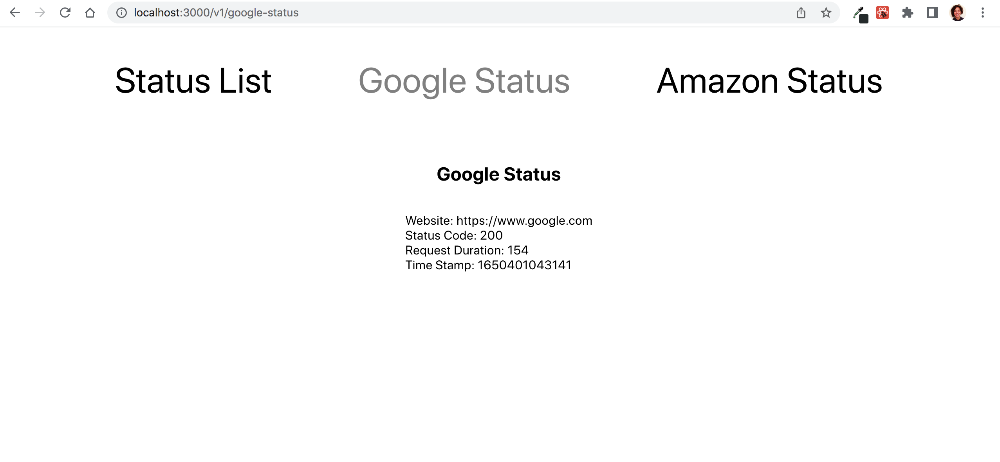
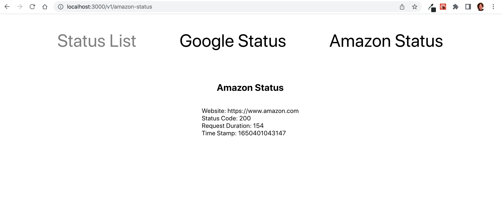

# Getting Started

Welcome! This is a small app that contains an express server and react front end, used to diplsay information from Google and Amazon with a simple UI.

I was able to get everything wired up with mock data - was still working on trying to ping the actual websites and get back the required json from that request.

## Available Scripts

In the project directory, you can run:

### `npm i`

This will install any dependencies. In this case, react router and express were used.

### `npm start`

Run this is both the main project directory, react-express-app and also the client directory so that you can run the react on 3000 and the server on 3001.

## Screenshots

Server - Google Json

Server - Amazon Json

Server - All Status Json

Home Page

All Status List

Google Status

Amazon Status

